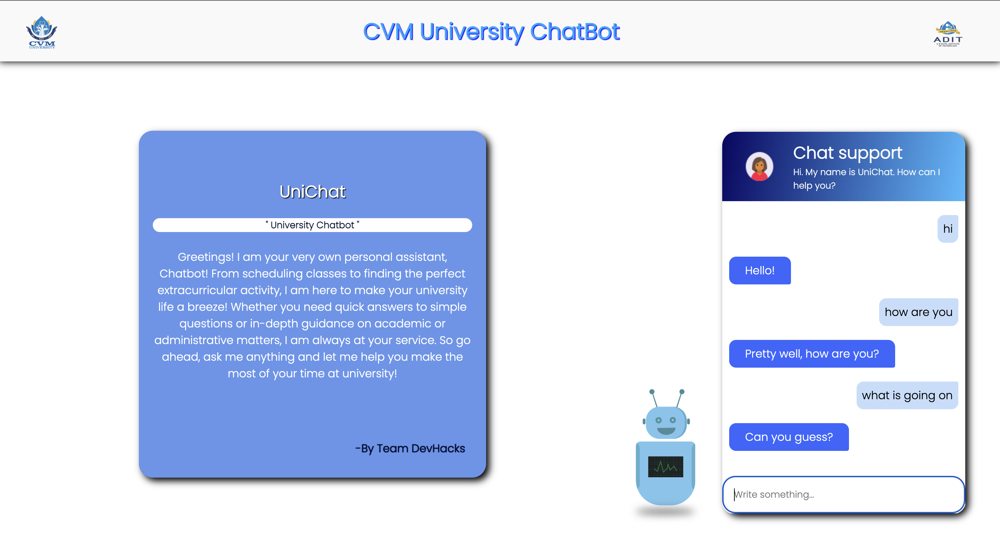
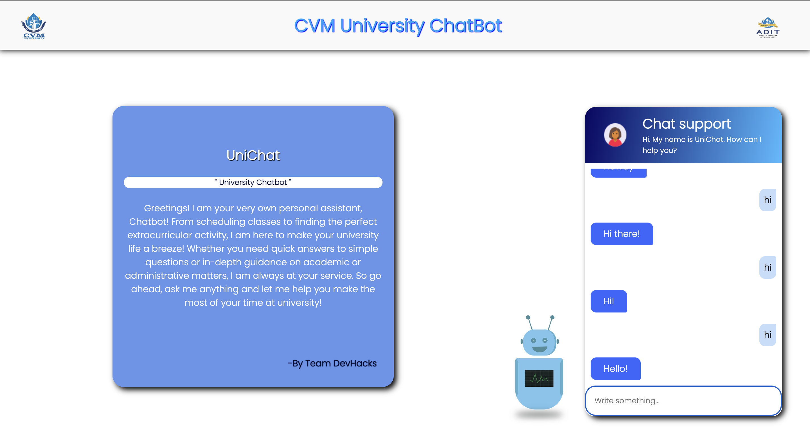

# CVM_UniChat
Created ChatBot for university website using Javascript

This is a very simple "chatbot" using nothing but JavaScript, HTML, & CSS. I put this in quotes because chatbots these days are way more complex - this is an exercise in vanilla JS loops and conditionals, not AI.

[Live Preview](https://cvm-uni-chat.vercel.app/)

## What does this College Enquiry Chatbot do ?

This chatbot will respond to students' queries regarding university. Questions like "How are you? ","How old are you", "What are other colleges of university?" can be answered by this chatbot.

All features :

- Information of University & colleges
- Queries related to faculty
- Course details & syllabus

## Tech Stack
 
- **frontend** - html,css,js  

## Screenshots

### Home Page

### Demo Pages

